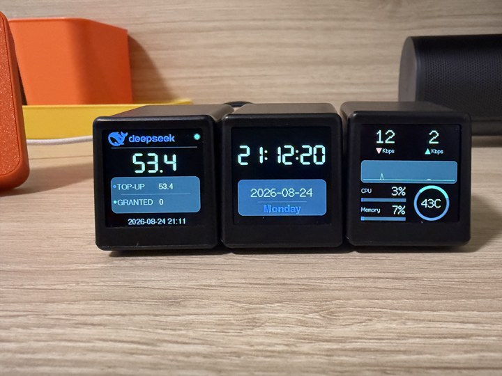

# SD2 小电视 · OpenWrt 网速监视器

在 [SD2 小电视](https://oshwhub.com/Q21182889/esp-xiao-dian-shi)（ESP8266 + 1.3 寸 ST7789 240×240 屏幕）上直接显示 OpenWrt 路由器网速的小固件。

路由器上放一个轻量 CGI 脚本（`router/traffic`），每次请求实时读接口计数器并差分出当前速率，连同 CPU / 内存 / CPU 温度返回一行小 JSON；小电视每秒 GET 一次直接显示。休眠时段由固件自己的 NTP 本地时间判断，不依赖路由器返回的小时。不需要额外客户端，固件里也没有路由器登录凭据。

## 屏幕效果



## 显示内容

- 上/下行实时速率：64px 大数字（<10 Mbps 保留一位小数，10 以上显示整数，Gbps 显示 1.2）
- 每个方向带小箭头、单位（Mbps/Kbps/Gbps）
- 最近 60 秒速率曲线（红=下行，绿=上行），透明背景无网格
- 左下方：CPU / Memory 两行（标签 + 百分比 + 进度条）
- 右下方：温度圆圈表盘（圆环 + 圆弧进度 + 中央温度，有温度传感器时显示）
- 启动页：开机显示 “Connecting WiFi...”，WiFi 30 秒连不上自动提示失败并持续重试
- 休眠时段（默认 0:00–7:00）：NTP 校时后按本地时间判断，关闭背光并停止刷新，到点自动唤醒

界面直接用 TFT_eSPI 绘制（内置 Font2 缩放 + 三角形箭头），不引入 LVGL，不打包自定义字体。

## 硬件

| 项目 | 说明 |
|------|------|
| 主控 | ESP8266（ESP-12E/F），PlatformIO `board = nodemcuv2` |
| 屏幕 | ST7789，240×240，SPI，**无 CS**，MISO 未接 |
| 烧录 | Micro USB + 板载 CH340 |

引脚（已写入 `platformio.ini` 的 TFT_eSPI 编译宏）：

| 功能 | NodeMCU | GPIO |
|------|---------|------|
| TFT DC | D3 | GPIO0 |
| TFT RST | D4 | GPIO2 |
| TFT SCLK | D5 | GPIO14 |
| TFT MOSI | D7 | GPIO13 |
| 背光 | D1 | GPIO5 |

购买成品时请和卖家确认带 CH340 芯片、支持自行烧录。

## 快速开始

1. 克隆工程时请使用 `git clone --recursive <仓库地址>`（或克隆后执行 `git submodule update --init`）。公共库 [`sd2-common`](https://github.com/Joee-D/sd2-common) 会作为子模块出现在 `lib/sd2-common`，构建时自动编译，无需额外操作。
2. 用 VS Code 打开本工程（已安装 PlatformIO 插件）。
3. 复制 [`src/config.example.h`](src/config.example.h) 为 `src/config.h`，然后编辑：
   ```bash
   cp src/config.example.h src/config.h
   ```
   - `WIFI_SSID` / `WIFI_PASS`：你的 WiFi
   - `ROUTER_HOST` / `ROUTER_PORT`：OpenWrt 地址（默认 192.168.1.1:80）
   - `NTP_SERVER` / `TZ_OFFSET_SEC`：NTP 服务器与本地时区（休眠按本地时间判断）
   - `SLEEP_START_HOUR` / `SLEEP_END_HOUR`：休眠时段（`-1` 禁用）
   - `BRIGHTNESS`：屏幕亮度（0~1023，默认 843，对应原固件占空比）
4. 路由器上安装数据接口（一次性）：
   ```bash
   scp router/traffic root@192.168.1.1:/www/cgi-bin/traffic
   ssh root@192.168.1.1 "chmod +x /www/cgi-bin/traffic"
   ```
   想监控哪个接口，改 `router/traffic` 里的 `IFACE`（如 `pppoe-wan` / `br-lan` / `eth0`）。
5. USB 连接小电视，点击 VS Code 底部 PlatformIO 工具栏的 **Upload**（或终端 `pio run -t upload`）。
6. 点击 **Serial Monitor**（波特率 921600）可查看日志。

## 目录结构

```
src/
├── main.cpp          主程序：TFT_eSPI 界面、WiFi、NTP、轮询、休眠
├── OpenWrtClient.h   轻量 HTTP GET 客户端（解析一行小 JSON）
├── config.example.h  配置模板（复制为 config.h 后填写，config.h 不入库）
└── config.h          本地配置（.gitignore 忽略，不会提交）
router/
└── traffic           OpenWrt CGI 数据接口（安装到 /www/cgi-bin/traffic）
images/               屏幕效果图
lib/sd2-common/       公共库子模块：WiFi 连接/校时/休眠/背光/HTTP/格式化
```

> 与 [`sd2-deepseek-balance`](https://github.com/Joee-D/sd2-deepseek-balance) 共用的基础功能（WiFi、定时休眠、背光、HTTP、格式化）已提炼到 [`sd2-common`](https://github.com/Joee-D/sd2-common)，本工程只保留网速监视相关的界面与 OpenWrt 数据解析。

## 工作原理

1. 开机显示启动页并连接 WiFi。
2. 通过 NTP 同步系统时间（ESP8266 无 RTC，休眠时段需要本地时间）。
3. 每秒 GET 一次 `http://192.168.1.1/cgi-bin/traffic`。
4. 路由器脚本读取 `/proc/net/dev` 计数器，与上次请求差分出字节/秒速率，连同 CPU（`/proc/stat` 差分）、内存占用、CPU 温度（`/sys/class/thermal`，无传感器返回 -1）返回。
5. 固件换算成 Mbps 并绘制：大数字、单位、60 秒曲线、CPU/Memory 进度条、温度表盘。
6. 休眠时段内关闭背光、停止刷新，NTP 本地时间到点自动唤醒。

## 常见问题

**1. 一直显示黑屏 / 无数据**

先确认没有一直停在启动页的 “Connecting WiFi...”（串口日志看是否有 `WiFi connected`）。连上后若仍无数据：在电脑上 `curl http://192.168.1.1/cgi-bin/traffic`，确认脚本已安装且有 JSON 输出；再看串口日志中是否有 `[owrt] tcp connect failed`。

**2. 一直不刷新 / 休眠时间不对**

休眠时段按 NTP 同步后的本地时间判断。看串口日志是否有 `NTP time synced`；若一直不出现，改 `config.h` 里的 `NTP_SERVER`（如 `ntp.tencent.com`、`pool.ntp.org`）。休眠时刻偏差请检查 `TZ_OFFSET_SEC`（东八区为 `8UL * 3600UL`）。

**3. 屏幕花屏 / 无显示**

- 确认是 ST7789 240×240（SD2 标准配置）；屏幕驱动与引脚已固化在 [`sd2-common/platformio/tft_setup.h`](https://github.com/Joee-D/sd2-common)，仅当硬件不同时才需要改。
- 背光亮度：`config.h` 中 `BRIGHTNESS`（0~1023）。

**4. 烧录失败**

- 确认数据线是数据线（不是纯充电线）。
- 上传波特率默认 921600，失败可改为 `upload_speed = 115200`。

**5. 想监控局域网总流量**

把 `router/traffic` 里的 `IFACE` 改为 `br-lan` 后重装脚本即可，固件不用改。

## 参考

- 硬件开源：https://oshwhub.com/Q21182889/esp-xiao-dian-shi
- 固件参考：https://github.com/Jason6111/sd2
- 姊妹项目：https://github.com/Joee-D/sd2-deepseek-balance
- 公共库：https://github.com/Joee-D/sd2-common
